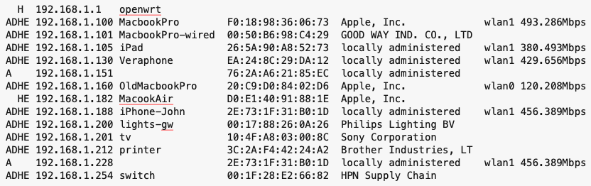

# wrtview

[](https://pypi.python.org/pypi/wrtview/)
[](https://pypi.python.org/pypi/wrtview/)
[](https://github.com/ropg/wrtview/blob/master/LICENSE)

`wrtview` compactly displays data about hosts on a network connected to an OpenWRT router by combining data from various files and the output of commands on the OpenWRT. It is typically ran on a computer connected to an openwrt-supplied network, not on the OpenWRT device itself.

## Installation

wrtview is a python package on [PyPI](https://pypi.org/project/wrtview). If you have python 3 installing is easy: 

```bash
pip install wrtview
```

Alternatively, you can clone the github repository and install from there:

```bash
git clone https://github.com/ropg/wrtview
cd wrtview
pip install .
```

## Setting up the access point for pubkey ssh access

For wrtview to work, you will want to set up ssh to provide pubkey (passwordless) access to your openwrt device. If you have a Mac or a linux machine, this is done by entering `scp ~/.ssh/id_rsa.pub root@<router>://etc/dropbear/authorized_keys`, replacing `<router>` with the name or ip-address of your router. If you type your password one last time you should now be able to log into your router without a pasword by just typing `ssh root@<router>`. As soon as that works you are all set up to use wrtview.

## Using wrtview

If your router is at 192.168.1.1, all you need to do is type `wrtview` and you'll see output like this:



As you can see, this network has a router called 'openwrt'. By default, all the hosts on the 'lan' network om the router are displayed. In the first column you can see whether a host is in the router's ARP table (`A`), whether it got a DHCP lease (`D`) and whether it is in the hosts (`H`) and ethers (`E`) file. Then there's the host's IP and name (the latter either from hosts, ethers or DHCP lease). After that there's the MAC-address and the manufacturer from the vendor database. Then if the MAC-address is found in the output of `iw <interface> station dump` for either wlan0 or wlan1, that is displayed with the expected throughput.

## Command line options

### `--network`, `-n`

By default, wrtview will display clients in the 'lan' network on the openwrt, but you can set a different network here.

&nbsp;

### `--wireless`, `-w`

By default, wrtview checks for clients on 'wlan0' and 'wlan1'. but you can specify wireless interfaces that you would like to check for clients on. You can specify multiple wireless interfaces, in the format `<interface>[@<host>][:<alias>]`. The hostname part allows you to check for clients on a different OpenWRT that may be serving a different part of a building. So for instance:

<font size=2>
`wrtview -w wlan0:S2 -w wlan1:S5 -w wlan0@192.168.0.4:N2 -w wlan1@192.168.0.4:N5 192.168.0.2`
</font>

will cause wrtview to connect to 192.168.1.2 for all the data, and show the 'wlan0' and 'wlan1' interfaces named as 'S2' and 'S5' respectively. Addtionally, this will cause wrtview to connect to 192.168.0.4 for data on clients to its 'wlan0' and 'wlan1' interfaces, marking their wifi connections 'N2' and 'N5' respectively in the output.